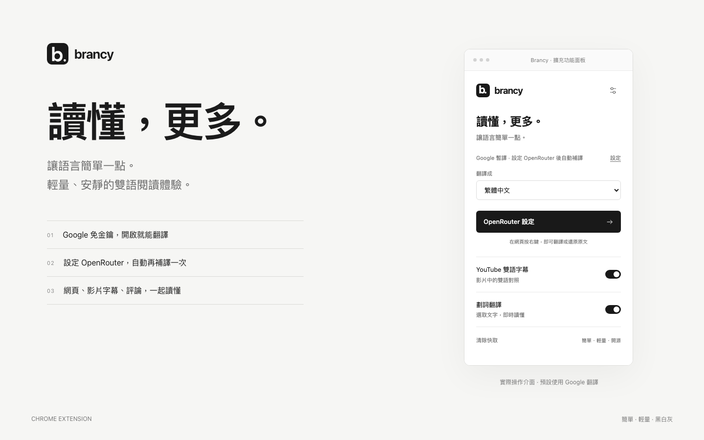
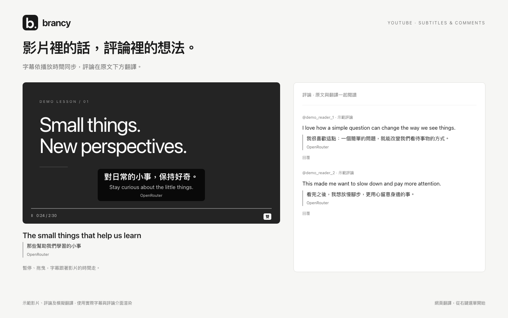

  

<h1 align="center">Brancy</h1>

讀懂，更多。讓語言簡單一點。

  <a href="https://github.com/bensonbs/brancy/releases/latest">下載最新版</a> ·
  <a href="#使用方式">安裝教學</a> ·
  <a href="#範例展示">範例展示</a>

黑白灰極簡風格的 Chrome 雙語翻譯擴充功能。原生 JavaScript、無前端框架、無須編譯。

## 範例展示

### YouTube 字幕與評論

字幕依影片時間同步；右鍵翻譯評論後，譯文顯示在每則原文下方，保留閱讀脈絡。

展示圖片由實際擴充功能介面渲染；影片場景、評論與翻譯使用示範資料，並非真實 API 翻譯結果。

## 使用方式

1. 從 [Releases](https://github.com/bensonbs/brancy/releases/latest) 下載 `brancy-v1.2.5.zip` 並解壓縮。
2. 在 `chrome://extensions` 開啟開發人員模式，選擇「載入未封裝項目」。
3. 選取解壓縮後含有 `manifest.json` 的 `brancy-v1.2.5` 目錄（開發者也可直接選取本專案目錄）。更新程式後，請在擴充功能管理頁按「重新載入」，並重新整理已開啟的網頁。
4. 在一般網頁按右鍵，選擇 **Brancy：翻譯網頁／還原原文**。再次選擇會移除譯文。

網頁翻譯僅由右鍵選單操作，沒有鍵盤快捷鍵。翻譯進行中也可再次選擇右鍵選單來停止並還原。

在 YouTube 觀看頁，右鍵翻譯會處理影片標題、說明及評論，不翻譯推薦影片、播放器與留言輸入區。譯文與簡短載入提示置於各則評論下方；捲動或展開回覆後，新載入的評論會接續翻譯，還原或切換影片後停止。

瀏覽器內部頁面、擴充功能商店等受限制頁面無法注入翻譯。對已開啟的一般網頁，右鍵操作會按需載入翻譯腳本。

## 翻譯流程

所有翻譯先使用免金鑰的 Google 網頁翻譯端點，在譯文位置顯示 **Google 暫譯**。不需選擇引擎，也不需 Google Cloud API Key。

設定 OpenRouter 後，會自動執行第二次翻譯：先顯示 Google 暫譯，再由 OpenRouter 參照原文補齊及修正。同一位置會顯示「Google 暫譯 · OpenRouter 補譯中…」，完成後更新為「OpenRouter」。沒有設定 OpenRouter 就只執行 Google；OpenRouter 失敗或逾時會保留暫譯並顯示提示。網頁、YouTube 評論、字幕及劃詞均使用此流程，不需要額外點擊。

在設定中點擊「取得 API Key」前往 [OpenRouter 金鑰頁](https://openrouter.ai/keys)，輸入金鑰即可啟用自動補譯。模型預填 `deepseek/deepseek-v4-flash-0731`，可自行輸入完整模型 ID，並按「測試連線」驗證。設定自動儲存於此瀏覽器，模型可用性依 OpenRouter 與帳號權限而定。

OpenRouter 使用串流回應，每次請求最多等待 60 秒，每批最多 8 段並依文字長度拆分，每個頁面最多同時執行 2 個補譯請求。Google 暫譯不會等待補譯完成。Google 使用非官方網頁端點，可用性取決於 Google。

## 其他功能

- 自動略過字幕中 `[...]`、`【...】`、`［...］` 內的所有文字（例如音樂、掌聲、笑聲或旁白），保留括號外的對話。
- YouTube 字幕優先翻譯目前播放位置：第一批 4 句，後續每批最多 8 句，完成即顯示；預先處理附近約 45 秒的字幕，拖曳後優先翻譯新位置，無須等待整部影片翻完。
- YouTube 雙語字幕依影片播放時間及原始字幕時間碼顯示；暫停凍結即時字幕、拖曳重新對齊，過期翻譯不會蓋回目前畫面。可調整字級、顏色與背景；固定原文在上、繁體中文在下。
- 劃詞翻譯與英文單字釋義，可隨時關閉。
- YouTube 字幕本機快取，可從面板或設定頁清除。
- YouTube 播放快捷鍵：`A` 上一句、`S` 重播、`D` 下一句、`E` 切換字幕。可在設定中關閉。

## 開發

`npm test` 執行 API 路由與右鍵選單測試。`npm install`、`npx playwright install chromium` 後，使用 `npm run test:ui` 執行瀏覽器介面與網頁翻譯流程測試，截圖輸出至 `artifacts/`。`npm run test:startup` 驗證 YouTube 啟動順序、延遲載入與重複注入。`npm run test:progressive` 驗證自動兩階段翻譯與失敗保留暫譯。`npm run test:youtube` 另外驗證字幕同步、非同步回應順序與評論翻譯。API 測試使用模擬回應，不會消耗金鑰額度；擴充功能本身不需要安裝任何套件。

主要檔案：`popup/` 工具列面板、`options/` 設定頁、`styles/base.css` 共用樣式、`background/page-translation.js` 右鍵選單、`background/translator.js` 翻譯服務、`content/webpage/` 網頁雙語與劃詞、`content/youtube/` 影片字幕。

右鍵選單與動態載入依照 [Chrome contextMenus API](https://developer.chrome.com/docs/extensions/reference/api/contextMenus) 與 [scripting API](https://developer.chrome.com/docs/extensions/reference/api/scripting)；翻譯串接參考 [OpenRouter Chat Completions](https://openrouter.ai/docs/api/api-reference/chat/send-chat-completion-request) 與 [串流協定](https://openrouter.ai/docs/api_reference/streaming)。

展示圖片位於 `docs/images/`，沿用 `icons/icon128.png` 的現有 Logo。安裝開發依賴後，可執行 `node scripts/generate-showcase.mjs` 重新產生圖片。

### YouTube 字幕顯示與狀態

影片雙語字幕固定顯示原語在上、繁體中文在下，不會改選使用者的 YouTube CC 字幕語言。CC 卡住時會重啟一次；若 CC 使用其他語言，Brancy 會另外讀取影片原語字幕。載入、等待翻譯、翻譯錯誤與逾時都有狀態提示；字幕翻譯等待超過 20 秒會顯示逾時。影片未提供可讀字幕時會提示原因，無法直接辨識燒錄在影片畫面中的文字。

未設定 OpenRouter API Key 時，不顯示翻譯來源標籤，仍保留載入、正在翻譯與錯誤提示。

影片同時提供原語人工字幕與自動字幕時，優先使用人工字幕的分句與時間碼；未提供人工字幕時仍使用自動字幕，且不更改 YouTube CC 語言。
